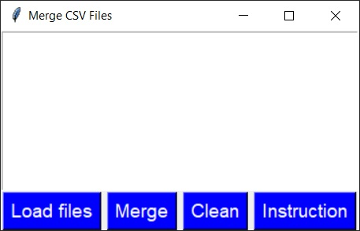

# Merge CSV Files

### Instructions for working with the program:

1. Click the "Load Files" button to select CSV files you want to merge.
2. Select one or more files from the file open window.
3. Click the "Merge" button to merge the selected files into one CSV file.
4. The merged CSV file will be saved in the Downloads directory.
5. Click the "Clear" button if you want to clear the list of loaded files to load others.

When selecting files, they can be selected multiple times.

Once you have selected one or more files, others can be added to them. This can be useful if the others are in a separate directory.

